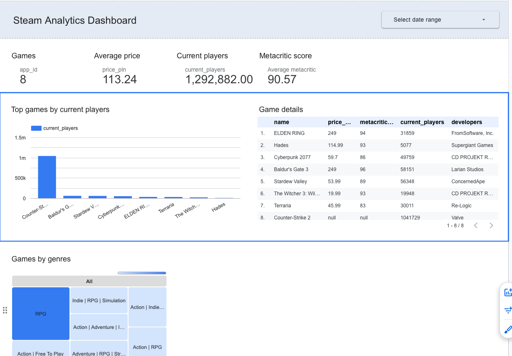

# Steam BI Pipeline

End-to-end data pipeline and Business Intelligence project using Steam data.

## Tech stack

- Python
- Pandas
- Steam API
- Google BigQuery
- Power BI

## Pipeline

```text
Steam API → Python → BigQuery → Power BI

## Dashboard Preview

The dashboard is built in Looker Studio and presents the latest Steam games snapshot loaded into BigQuery.

Features:
- Total number of games
- Average game price (PLN)
- Current players
- Average Metacritic score
- Top games by current players
- Genre distribution
- Detailed game table

